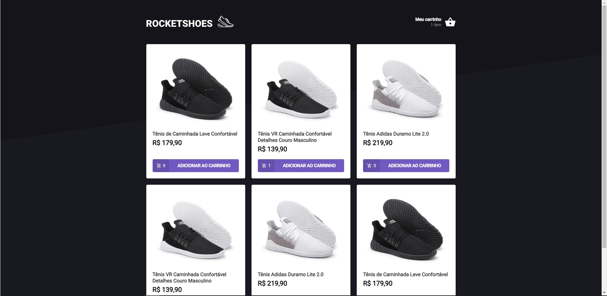
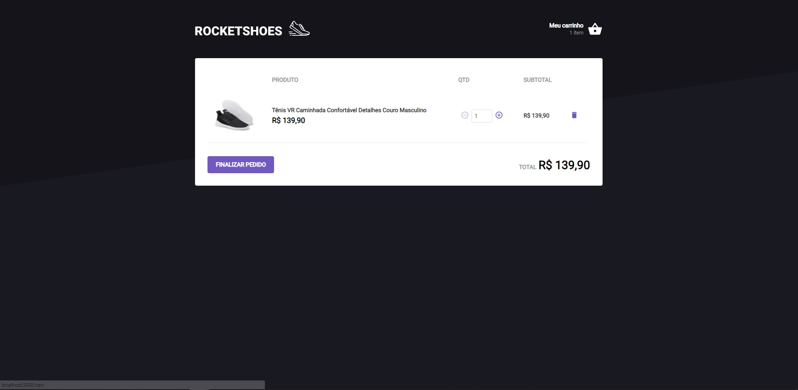

<h1>RocketShoes</h1>

Aplicação prática de loja virtual de calçados.
Desenvolvido durante o Ignite da rocketseat.

## 🚀 Tecnologias

- React JS
- JsonServer
- React-Toastify

## 💻 Projeto

  <ul>
    <li>Lista de produtos, cada produto mantém a sua quantidade enviada para o carrinho de compras, o botão adicionar incrementa 1 à quantidade caso o produto já esteja no carrinho</li>
    <li>Carrinho de compras, mantém todos os produtos e suas quantidades selecionadas. Faz o cálculo do subtotal e total da compra </li>
  </ul>

## 🔖 Layout

<table>
  <tr>
    <td><strong>Lista Produtos</strong></td>
    <td><strong>Carrinho</strong></td>
  <tr>
   <tr>
    <td></td>
    <td></td>
  <tr>
</table>

## Instalar
```bash
# Clonar repositorio
$ git clone https://github.com/nilbersilva/ignite-template-reactjs-criando-um-hook-de-carrinho-de-compra

# Acessar pasta
$ cd ignite-template-reactjs-criando-um-hook-de-carrinho-de-compra

# Instalar Dependências
$ yarn

# Iniciar Servidor JsonServer
$ yarn server

# Iniciar Aplicação
$ yarn start

# A Aplicação vai rodar no seguinte URL: http://localhost:3000
```

## Licença

Esse projeto está sob a licença MIT.

<a href="#top">Back to top</a>
